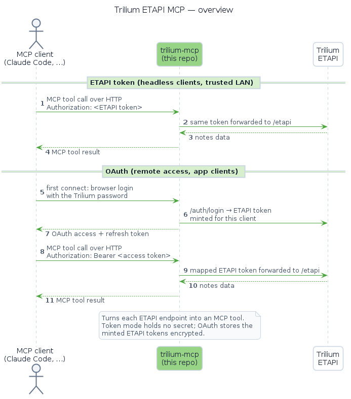
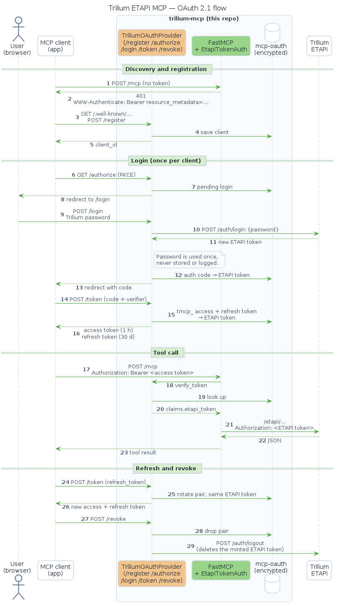

<p align="center">
  
</p>

<h1 align="center"><a href="https://github.com/Marceltov/trilium-mcp">Trilium ETAPI MCP server</a></h1>

<p align="center">
  <a href="https://github.com/Marceltov/trilium-mcp/pkgs/container/trilium-mcp">
    
  </a>
  <a href="LICENSE">
    
  </a>
  <a href="https://github.com/Marceltov/trilium-plugin">
    
  </a>
</p>

A standalone [MCP](https://modelcontextprotocol.io) server that exposes the
[Trilium](https://triliumnotes.org) [ETAPI](https://github.com/TriliumNext/Trilium)
(External API) as MCP tools. It runs as a **container sidecar** next to your Trilium
instance: nearly every documented ETAPI endpoint is turned into an MCP tool at startup
via `FastMCP.from_openapi` (**all 38 tools** — `createNote`, `getNoteById`, `searchNotes`,
`exportNoteSubtree`, …; the auth session endpoints `login`/`logout` are excluded),
served over streamable **HTTP** so any MCP client connects to it by URL.

> [!IMPORTANT]
> If your client is [Claude Code](https://code.claude.com), this is best used together with [`trilium-plugin`](https://github.com/Marceltov/trilium-plugin) — the client-side counterpart to this repo, bundling the `.mcp.json` wiring plus ready-made skills (create/delete/move/rename/search notes, manage attributes, work with templates and journal notes, export a subtree) that call these tools, so you get a working Trilium client without writing any of the tool-call glue yourself.

## Contents

- [Contents](#contents)
- [Architecture](#architecture)
- [Quick start](#quick-start)
- [Connecting a client](#connecting-a-client)
- [Configuration](#configuration)
- [TLS / reverse proxy](#tls--reverse-proxy)
- [Security](#security)
- [How it works](#how-it-works)
- [Alternatives](#alternatives)
- [Contributing](#contributing)
- [License](#license)

## Architecture

<p align="center">
  
</p>

**trilium-mcp** (this repo) runs as a container sidecar and talks to Trilium over the internal Docker network, so Trilium's ETAPI is never exposed publicly on its own. Clients reach trilium-mcp either through a TLS-terminating reverse proxy or directly over a trusted LAN, and authenticate in one of two ways (see [Choosing an auth method](#choosing-an-auth-method)): **OAuth** — log in once in the browser with your Trilium password; best for remote access and app clients — or an **ETAPI token** in the `Authorization` header; best for headless clients and the local LAN.

## Quick start

**1. Create an ETAPI token in Trilium** — *Options → ETAPI → Create new ETAPI token*.
This token is the only credential: trilium-mcp stores no secret and forwards the raw token
straight through to Trilium. Each client presents its own token per request. (Connecting remote or app clients? Skip the token and use [OAuth](#oauth-remote-access-and-app-clients) instead.)

<p align="center">
  
</p>

**2. Add trilium-mcp to your Trilium's `docker-compose.yaml`** — one service, pulling the
prebuilt image, so there's nothing to clone or build:

```yaml
services:
  trilium:
    # ... your existing Trilium service ...

  trilium-mcp:
    image: ghcr.io/marceltov/trilium-mcp:latest
    container_name: trilium-mcp
    restart: unless-stopped
    environment:
      # Service name of your existing Trilium on the same compose network.
      TRILIUM_SERVER_URL: http://trilium:8080
      # Optional — enables OAuth login (see "Choosing an auth method"):
      # MCP_BASE_URL: https://trilium-mcp.example.com
      # MCP_OAUTH_SECRET: <long random string>
    # volumes:
    #   - mcp-oauth:/data   # keeps OAuth logins across restarts
    ports:
      - "8081:8081"
```

Then start it:

```bash
docker compose up -d trilium-mcp
```

Both services share the compose network, so `trilium` resolves to your existing container. If
your Trilium runs elsewhere (a separate compose project or host), point `TRILIUM_SERVER_URL` at a
URL this container can reach and attach it to the right network — see [Configuration](#configuration).
The MCP endpoint is then available at `http://localhost:8081/mcp`.

**3. Connect your MCP client** with the token from step 1:

```bash
claude mcp add trilium --scope user --transport http \
  http://localhost:8081/mcp \
  --header "Authorization: YOUR_TRILIUM_ETAPI_TOKEN"
```

Your client now has the Trilium tools. See [Connecting a client](#connecting-a-client) for
remote hosts, multiple instances, and `.mcp.json`.

## Connecting a client

### Choosing an auth method

| Method | Best for | How the client authenticates |
| ------ | -------- | ---------------------------- |
| **OAuth** | Remote access and app clients (Claude desktop / web / mobile, IDEs, anything that can open a browser) | Only the URL is configured; on first connect a browser page asks for your Trilium password once, and the server mints a dedicated ETAPI token for that client. Nothing secret is pasted into client config. |
| **ETAPI token** | Headless clients (scripts, CI, servers, agents with no browser) and the local LAN | The token from *Options → ETAPI* goes in the `Authorization` header on every request. |

Both work side by side in the default `both` mode once OAuth is configured (`MCP_BASE_URL` + `MCP_OAUTH_SECRET`, see [OAuth details](#oauth-details)); without those variables the server accepts ETAPI tokens only. OAuth needs an **HTTPS** public URL (plain `http` only for `localhost`), so it goes with a reverse proxy; an ETAPI token over plain HTTP is for networks you trust.

### OAuth (remote access and app clients)

Register the URL with no header; the client opens the login page on first use:

```bash
claude mcp add trilium --scope user --transport http https://trilium-mcp.example.com/mcp
```

In Claude Code, run `/mcp` and pick the server to authenticate. On claude.ai (*Settings → Connectors → Add custom connector*), make sure you are **already logged in to claude.ai** before adding the connector: if claude.ai asks you to log in partway through, it can drop the finished OAuth login, and the connector stays unauthenticated with no tools. Remove that connector and add it again; the second attempt goes straight through. Each client gets its own ETAPI token, visible and deletable under *Options → ETAPI* — deleting it there, or revoking the OAuth token, disconnects just that client.

### ETAPI token (headless and LAN)

The ETAPI token is the credential — pass it in the `Authorization` header. Point the URL at
wherever trilium-mcp is reachable (a TLS reverse proxy, or the container directly on a trusted LAN):

```bash
# Behind a reverse proxy (TLS)
claude mcp add trilium --scope user --transport http \
  https://your-host/mcp \
  --header "Authorization: YOUR_TRILIUM_ETAPI_TOKEN"

# Directly over a trusted LAN (plain HTTP), by IP or hostname
claude mcp add trilium --scope user --transport http \
  http://192.168.1.50:8081/mcp \
  --header "Authorization: YOUR_TRILIUM_ETAPI_TOKEN"
```

Register **multiple instances** by repeating with a different URL + token; each deployment uses
the same image and is bound to one Trilium via `TRILIUM_SERVER_URL`:

```bash
claude mcp add trilium-work --scope user --transport http \
  https://work-host/mcp \
  --header "Authorization: WORK_TOKEN"
```

The `--scope user` flag registers the server across **all** your projects, which is usually what
you want for a personal knowledge base. Drop it to fall back to `claude mcp add`'s default **local**
scope — available only to you in the current project:

```bash
claude mcp add trilium --transport http \
  http://localhost:8081/mcp \
  --header "Authorization: YOUR_TRILIUM_ETAPI_TOKEN"
```

The raw token is what Trilium's ETAPI expects. A `Bearer ` prefix is also accepted (it is
stripped before the request is forwarded), so `Authorization: Bearer YOUR_TOKEN` works too.

Alternatively, use the provided [`.mcp.json`](.mcp.json), filling in your host and token.

## Configuration

All configuration is via environment variables:

| Variable             | Default               | Purpose                                                                                                  |
| -------------------- | --------------------- | -------------------------------------------------------------------------------------------------------- |
| `TRILIUM_SERVER_URL` | `http://trilium:8080` | Base URL of the Trilium instance (`/etapi` is appended automatically).                                   |
| `MCP_HOST`           | `0.0.0.0`             | Interface the MCP server binds to.                                                                       |
| `MCP_PORT`           | `8081`                | Port the MCP server listens on.                                                                          |
| `MCP_PATH`           | `/mcp`                | HTTP path the MCP endpoint is served at.                                                                 |
| `TRILIUM_ETAPI_SPEC` | bundled spec          | Override the OpenAPI spec path.                                                                          |
| `MCP_ALLOWED_HOSTS`  | *(unset = any)*       | Comma-separated `Host` allowlist (DNS-rebinding protection). Unset accepts any Host; set it to restrict. |
| `MCP_AUTH_MODE`      | `both` if the two OAuth variables are set, else `token` | `token` (raw ETAPI token in `Authorization`), `oauth` (OAuth 2.1 only) or `both`. |
| `MCP_BASE_URL`       | *(unset)*             | Public URL clients reach this server at, e.g. `https://trilium-mcp.example.com`. The OAuth issuer: must be HTTPS (plain `http` only for `localhost`). Required for `oauth`/`both`. |
| `MCP_OAUTH_SECRET`   | *(unset)*             | Encrypts the OAuth store at `/data/oauth` (mount a volume at `/data`). Required for `oauth`/`both`; changing it logs every OAuth client out. |

### OAuth details

With `MCP_BASE_URL` and `MCP_OAUTH_SECRET` set, clients that support the MCP authorization spec need only the URL: on first connect they open a login page served by this server, you enter your **Trilium password**, and the server mints a dedicated ETAPI token for that client (visible and deletable in Trilium's ETAPI token list). The password goes to Trilium once and is never stored. Revoking a client's OAuth token also deletes its ETAPI token in Trilium. Raw ETAPI tokens in the `Authorization` header (with or without `Bearer `) keep working in the default `both` mode. An invalid `MCP_AUTH_MODE`, or an explicit `oauth`/`both` without its variables, starts the server in the `startup_error` state described under Security.

## TLS / reverse proxy

The container serves plain HTTP on `:8081`; terminate TLS at your reverse proxy.
Example Caddyfile:

```
your-host {
    reverse_proxy mcp:8081
}
```

## Security

The MCP endpoint grants **full read/write access to your notes**. Every request must carry either a Trilium ETAPI token or an OAuth access token issued by this server in the `Authorization` header; requests with no `Authorization` header at all are rejected with `401` before reaching any tool. The server never validates an ETAPI token itself — validity is enforced by Trilium when the forwarded request reaches the actual ETAPI call — and in token-only mode it holds no secret of its own. The `/health` endpoint is always unauthenticated (used by the container
healthcheck).

The token is sent in the `Authorization` header on every call. Over plain HTTP it travels
in cleartext, so either keep traffic on a **trusted network** (e.g. a LAN or the Docker
network) or put TLS in front — the Caddy reverse proxy above terminates TLS so the token
never crosses an untrusted hop. Direct `http://<lan-ip>:8081` access is fine on a network
you trust.

By default the server accepts requests for **any** `Host` (FastMCP's DNS-rebinding
protection is disabled), so it can be reached by LAN IP or by the domain your reverse proxy
forwards. To lock this down, set `MCP_ALLOWED_HOSTS` to a comma-separated list of the
host[:port] values you actually use (e.g. `192.168.1.50:8081,trilium.example.com`);
`localhost` is always allowed, and anything else gets a `421`.

With OAuth enabled (see [OAuth details](#oauth-details)) the server does hold secrets: the ETAPI tokens it mints, stored Fernet-encrypted under `/data/oauth` with the key from `MCP_OAUTH_SECRET`. Protect that volume and that variable like the tokens themselves. The login page shows which client is asking and where the authorization code will be sent. Only approve logins you started yourself, because any client can register and send you a login link.

If the OpenAPI spec cannot be loaded at startup, the server still starts and completes
the MCP handshake, but exposes only a single `startup_error` tool describing how to fix
it (rather than failing with an opaque connection error).

## How it works

At a glance, trilium-mcp forwards the client's ETAPI token straight through to Trilium — or, with OAuth, the ETAPI token it minted for that client at login:

<p align="center">
  
</p>

<details>
<summary>Detailed sequence (startup, auth gate, token pass-through)</summary>

<p></p>

Startup builds the tools from the OpenAPI spec, the middleware rejects any request without an
`Authorization` header, and the token is carried per request from the middleware to the outgoing
ETAPI call:

<p align="center">
  
</p>

</details>

<details>
<summary>Detailed OAuth sequence (discovery, login, tool call, refresh, revoke)</summary>

<p></p>

The client discovers the OAuth endpoints from the `401`, registers itself, and sends the user to the login page. The Trilium password is exchanged once for a fresh ETAPI token; the client only ever holds opaque `tmcp_` tokens that map to it:

<p align="center">
  
</p>

</details>

## Alternatives

Other open-source Trilium/TriliumNext MCP servers exist. Most are stdio subprocesses that
connect a single local client to one Trilium using a token baked into the environment or a
config file. trilium-mcp is instead **HTTP-native** and forwards each client's token
**per request**, so a single sidecar can serve many clients — each presenting its own token —
while storing no secret of its own. (Like the others, one sidecar fronts one Trilium, set via
`TRILIUM_SERVER_URL`; run one per instance.) Its tools are also **generated from the ETAPI
OpenAPI spec** (full endpoint coverage) rather than hand-written.

| Project                                                                             | Language   | Transport           | Token handling                                                            | Tools                           | Docker image         | Latest activity |
| ----------------------------------------------------------------------------------- | ---------- | ------------------- | ------------------------------------------------------------------------- | ------------------------------- | -------------------- | --------------- |
| **trilium-mcp** (this)                                                              | Python     | Streamable **HTTP** | Per-request `Authorization` pass-through, or OAuth 2.1 login (many clients) | **~40**, generated from OpenAPI | Yes (sidecar + GHCR) | active          |
| [tan-yong-sheng/triliumnext-mcp](https://github.com/tan-yong-sheng/triliumnext-mcp) | TypeScript | stdio               | Env var, baked in                                                         | 11, hand-written                | Yes (GHCR)           | Mar 2026        |
| [paerrin/trilium-mcp-server](https://codeberg.org/paerrin/trilium-mcp-server)       | Node.js/TS | stdio               | Config file, multi-instance                                               | 24, hand-written                | No                   | Jan 2026        |
| [radonx/mcp-trilium](https://github.com/radonx/mcp-trilium)                         | JavaScript | stdio               | Env var, baked in                                                         | 4, hand-written                 | No                   | Aug 2025        |

**Maintenance** (as of July 2026): [tan-yong-sheng/triliumnext-mcp](https://github.com/tan-yong-sheng/triliumnext-mcp)
is the most active and popular (≈63 stars, last commit March 2026), though it labels itself a
prototype. [paerrin/trilium-mcp-server](https://codeberg.org/paerrin/trilium-mcp-server) saw a
short burst of releases (Dec 2025 → v0.1.7 in Jan 2026) and has been quiet since. [radonx/mcp-trilium](https://github.com/radonx/mcp-trilium)
has had no commits since August 2025 (~3 commits total, 1 star) and **appears abandoned**.

## Contributing

For local development there's a ready-to-run stack — a throwaway Trilium seeded
with the default demo notes plus the MCP server built from local source
(`docker compose up -d --build`). See [CONTRIBUTING.md](CONTRIBUTING.md) for the
dev setup, seed-instance credentials, and how to run the tests.

## License

Copyright © 2026 Marcel Bruckner.

Licensed under the [GNU Affero General Public License v3.0 or later](LICENSE)
(AGPL-3.0-or-later). You may use, modify, and redistribute it, but any modified
version — **including one you run as a network service** — must be released under
the same license with its source made available to its users, and the original
copyright notice preserved. See [LICENSE](LICENSE) for the full terms.
