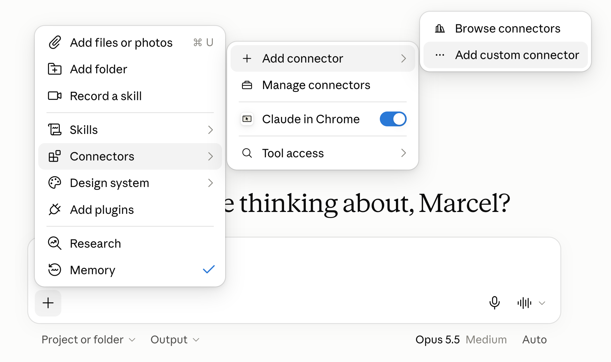
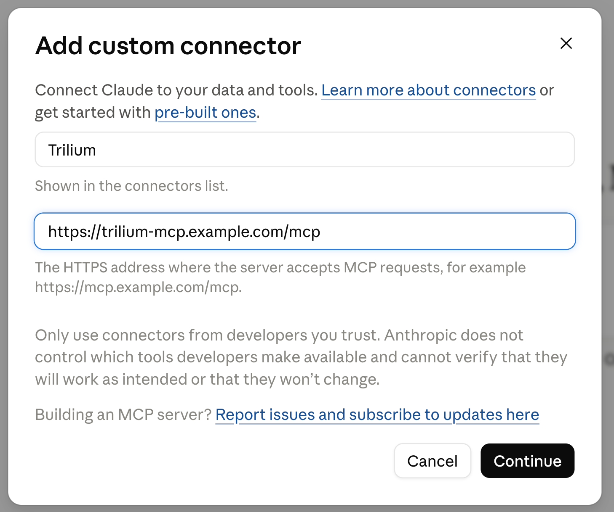
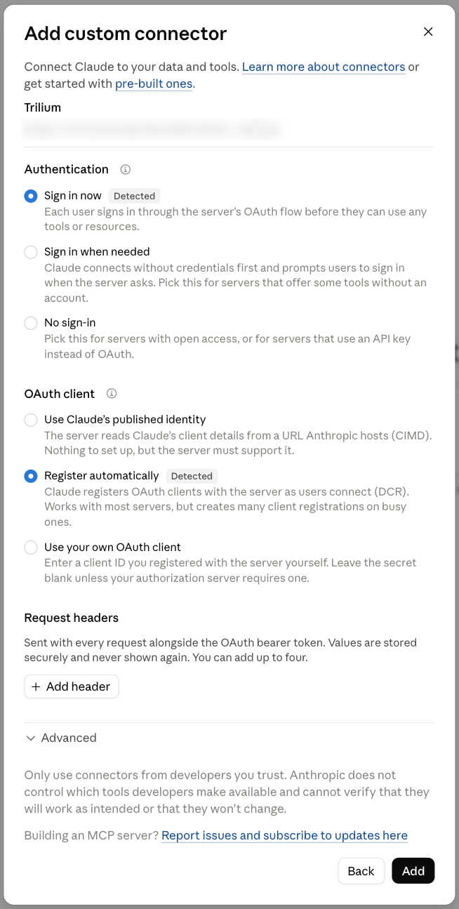
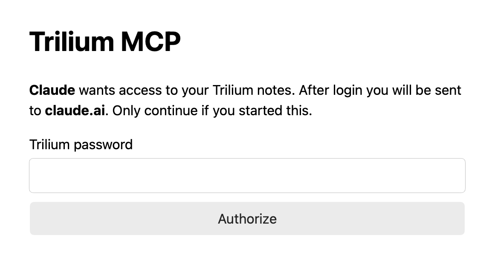
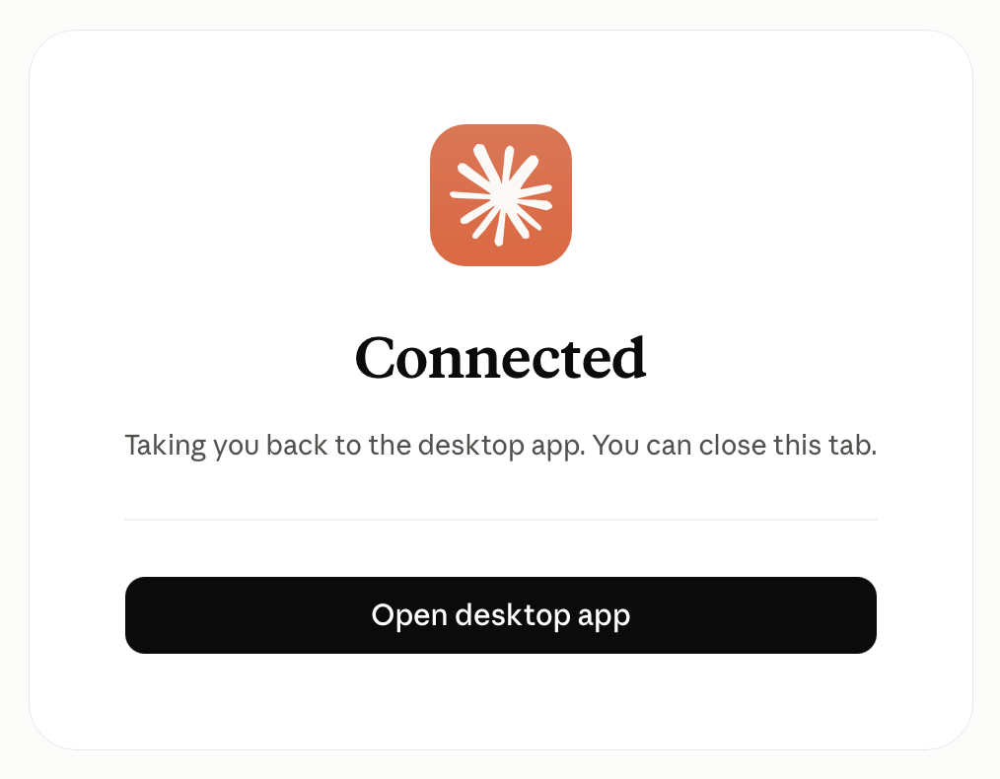
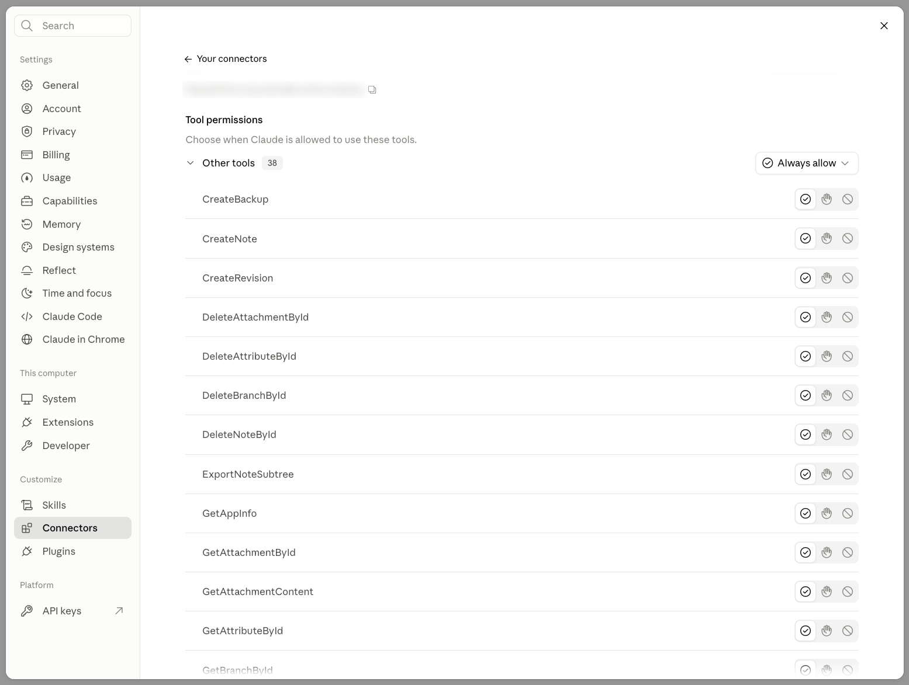

# Claude.ai

Claude.ai connects through a custom connector that signs in with [OAuth](connecting.md#choosing-an-auth-method), so the server needs `MCP_BASE_URL` and `MCP_OAUTH_SECRET` set and an HTTPS public URL. A connector you add on the web is also available in the Claude desktop and mobile apps.

!!! warning "Log in to claude.ai first"

    Make sure you are already logged in to claude.ai before adding the connector. If claude.ai asks you to log in partway through, it can drop the finished OAuth login, and the connector stays unauthenticated with no tools. Remove that connector and add it again; the second attempt goes straight through.

1. In a new chat, open the **+** menu below the message box and choose *Connectors → Add connector → Add custom connector*. *Settings → Connectors* has the same button.

    { width="720" }

2. Enter a name (for example `Trilium`, shown in the connectors list) and the URL `https://trilium-mcp.example.com/mcp`, then click **Continue**.

    { width="560" }

3. Claude.ai detects the server's OAuth support. Keep the detected choices, **Sign in now** and **Register automatically**, and click **Add**. No request headers are needed.

    { width="480" }

4. The trilium-mcp login page opens. Enter your Trilium password and click **Authorize**; you are sent back to claude.ai. If you added the connector in Claude Desktop, your browser first asks *Finish connecting a connector?*; click **Continue connecting**.

    { width="480" }

    From Claude Desktop, the tab then shows **Connected** and hands you back to the app; close it or click **Open desktop app**.

    { width="400" }

5. In a chat, open **+ → Connectors** and switch the connector on to use its tools.
6. Check that all tools arrived: open the connector under *Settings → Connectors*. **Tool permissions** should list all 38 tools. If the list is empty, the login didn't finish; see the warning above.

    { width="720" }

    The same list lets you choose per tool whether Claude may always use it, must ask first, or may never use it, for example asking first for the `Delete…` tools.

The connector gets its own ETAPI token, visible and deletable under *Options → ETAPI* in Trilium. Deleting it there disconnects just this connector.

## More than one Trilium

For more than one Trilium, add one connector per trilium-mcp container, each under its own name.
