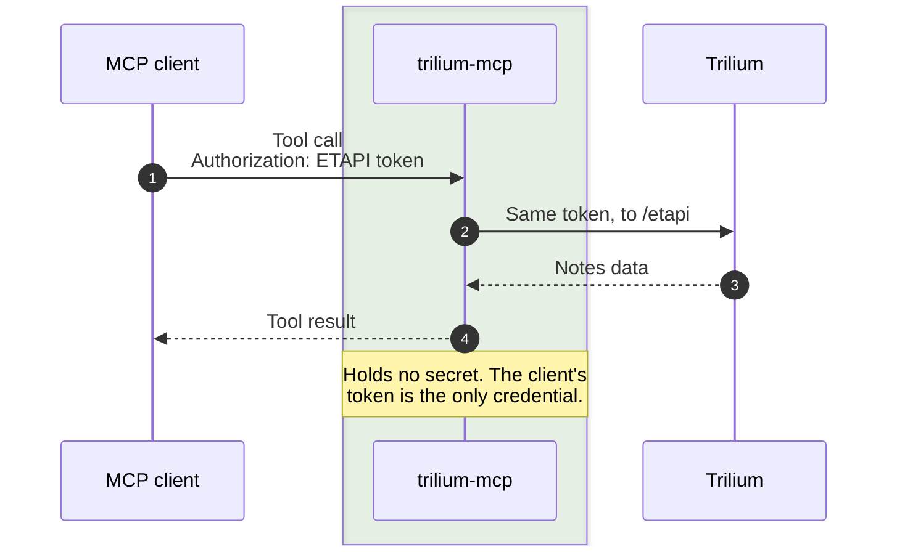
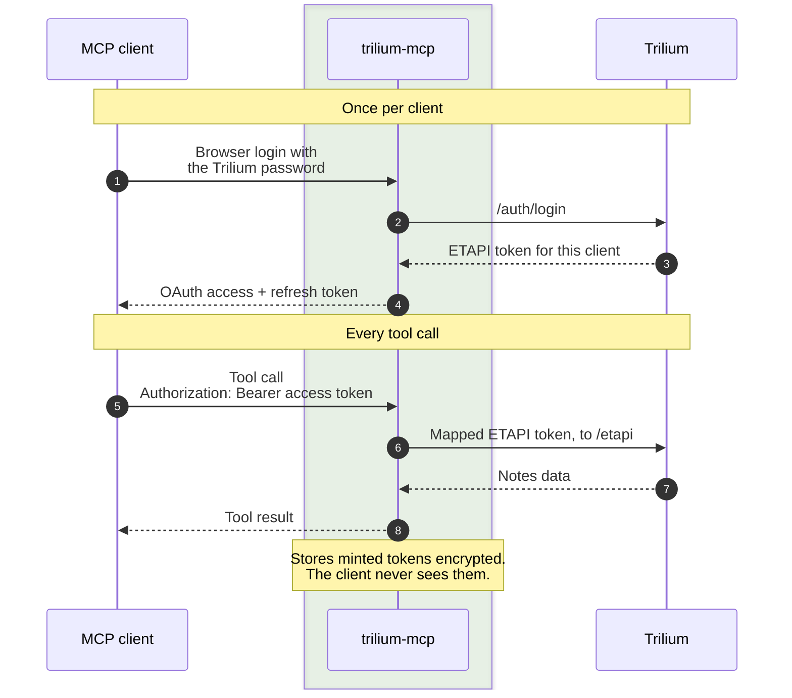

---
hide:
  - toc
---

# How it works

trilium-mcp turns every ETAPI endpoint into an MCP tool and forwards each call to Trilium with an ETAPI token: either the one the client sent, or, with OAuth, the one it minted for that client at login.

```mermaid
--8<-- "docs/diagrams/architecture.mmd"
```

trilium-mcp runs as a container sidecar and talks to Trilium over the internal Docker network, so Trilium's ETAPI is never exposed publicly on its own. Clients reach it through a TLS-terminating reverse proxy or directly over a trusted LAN.

## Tools from the OpenAPI spec

At startup the server reads the bundled ETAPI OpenAPI spec and generates one tool per endpoint with `FastMCP.from_openapi`. A few endpoints don't fit the JSON-in, JSON-out shape and are handled specially:

- **Text and HTML responses** (such as `getNoteContent`) keep the generated tool but drop its output schema.
- **ZIP export** (`exportNoteSubtree`) is replaced by a tool that unpacks the archive and returns readable text.
- **Plain-text uploads** (`putNoteContentById`, `putAttachmentContentById`) are replaced by tools that send the body with an explicit `text/plain` content type.
- **`login` and `logout`** are left out: clients already authenticate through the header, and logout would invalidate their own credential.

## ETAPI token

The client's token passes through unchanged. trilium-mcp stores nothing.



??? note "In detail: tool call in token mode"

    The middleware rejects any request without an `Authorization` header. The token is carried per request, in a context variable, from the middleware to the outgoing ETAPI call.

    ```mermaid
    sequenceDiagram
      autonumber
      participant C as MCP client
      box rgba(76, 165, 62, 0.1) trilium-mcp
        participant MW as TokenCapture<br>Middleware
        participant F as FastMCP<br>tools
        participant H as httpx +<br>EtapiTokenAuth
      end
      participant T as Trilium
      Note over C,T: Missing token
      C->>MW: POST /mcp, no Authorization
      MW-->>C: 401 WWW-Authenticate: Bearer
      Note over C,T: Tool call
      C->>MW: POST /mcp<br>Authorization: token
      MW->>MW: Stash token in<br>_incoming_auth
      MW->>F: Forward request
      F->>H: Call the mapped<br>ETAPI operation
      H->>H: Read token,<br>strip "Bearer "
      H->>T: /etapi/…<br>Authorization: raw token
      T->>T: Validate token
      T-->>H: JSON
      H-->>F: Response
      F-->>MW: Tool result
      MW->>MW: Reset context variable
      MW-->>C: Tool result
    ```

## OAuth

A one-time browser login mints an ETAPI token for the client. After that, the client only holds opaque OAuth tokens that map to it.



??? note "In detail: login (discovery, registration, password, code exchange)"

    The client discovers the OAuth endpoints from the `401`, registers itself, and sends the user to the login page. The Trilium password is exchanged once for a fresh ETAPI token; the client only ever holds opaque `tmcp_` tokens that map to it.

    ```mermaid
    sequenceDiagram
      autonumber
      actor U as User
      participant C as MCP client
      box rgba(76, 165, 62, 0.1) trilium-mcp
        participant A as OAuth<br>provider
        participant S as mcp-oauth<br>store
      end
      participant T as Trilium
      Note over U,T: Discovery and registration
      C->>A: POST /mcp, no token
      A-->>C: 401 with resource metadata
      C->>A: GET /.well-known/…<br>POST /register
      A->>S: Save client
      A-->>C: client_id
      Note over U,T: Password login
      C->>A: GET /authorize (PKCE)
      A->>S: Pending login, 10 min
      A-->>U: Redirect to /login
      U->>A: POST /login<br>Trilium password
      A->>T: POST /auth/login
      T-->>A: New ETAPI token
      Note over A: The password is used once,<br>never stored or logged.
      A->>S: Auth code → ETAPI token
      A-->>C: Redirect with code
      Note over U,T: Code exchange
      C->>A: POST /token<br>code + verifier
      A->>S: tmcp_ tokens → ETAPI token
      A-->>C: Access token (1 h)<br>refresh token (30 d)
    ```

??? note "In detail: tool call in oauth or both mode"

    `verify_token` maps a `tmcp_` token to its ETAPI token. In `both` mode any other token is passed through as a raw ETAPI token, and an expired `tmcp_` token gets a `401` so the client refreshes.

    ```mermaid
    sequenceDiagram
      autonumber
      participant C as MCP client
      box rgba(76, 165, 62, 0.1) trilium-mcp
        participant F as FastMCP<br>auth + tools
        participant A as verify_token
        participant H as httpx +<br>EtapiTokenAuth
      end
      participant T as Trilium
      C->>F: POST /mcp<br>Bearer tmcp_ token or raw ETAPI token
      Note over F: both mode: a raw header<br>gets a "Bearer " prefix first
      F->>A: verify_token(token)
      A->>A: Look up in the<br>mcp-oauth store
      alt Issued by us (tmcp_)
        A-->>F: etapi_token = mapped token
      else Not ours, both mode
        A-->>F: etapi_token = the raw token
      else Expired or revoked, or oauth mode
        A-->>F: None
        F-->>C: 401, client refreshes or logs in
      end
      F->>H: Call the mapped<br>ETAPI operation
      H->>H: Read etapi_token<br>from the access token
      H->>T: /etapi/…<br>Authorization: ETAPI token
      T-->>H: JSON
      H-->>F: Response
      F-->>C: Tool result
    ```

??? note "In detail: refresh and revoke"

    Refreshing rotates the OAuth token pair onto the same ETAPI token. Revoking drops the pair and deletes the ETAPI token in Trilium.

    ```mermaid
    sequenceDiagram
      autonumber
      participant C as MCP client
      box rgba(76, 165, 62, 0.1) trilium-mcp
        participant A as OAuth<br>provider
        participant S as mcp-oauth<br>store
      end
      participant T as Trilium
      Note over C,T: Refresh, when the access token expires
      C->>A: POST /token<br>grant_type=refresh_token
      A->>S: Drop the old pair
      A->>S: New tmcp_ pair → same ETAPI token
      A-->>C: New access + refresh token
      Note over C,T: Revoke, to disconnect this client
      C->>A: POST /revoke
      A->>S: Drop the pair
      A->>T: POST /auth/logout
      Note over T: Deletes the ETAPI token<br>minted for this client.
    ```

## Startup and health

??? note "In detail: startup, startup_error fallback, health check"

    If the spec or the auth configuration is invalid, the server serves a `startup_error`-only tool list instead of crashing.

    ```mermaid
    sequenceDiagram
      autonumber
      actor O as Container runtime
      box rgba(76, 165, 62, 0.1) trilium-mcp
        participant M as main()
        participant F as FastMCP
      end
      O->>M: Start
      M->>M: resolve_auth_mode()
      M->>F: build_server()
      F->>F: Load the bundled<br>ETAPI OpenAPI spec
      F->>F: from_openapi → ~40 tools
      F-->>M: Server
      Note over M: Invalid spec or auth config:<br>serve startup_error instead.
      M->>M: serve() behind the<br>auth-mode gate
      Note over O,F: Health check, always unauthenticated
      O->>F: GET /health
      F-->>O: 200 ok
    ```
