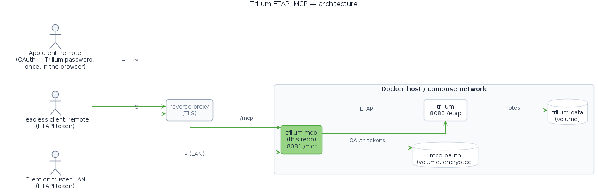
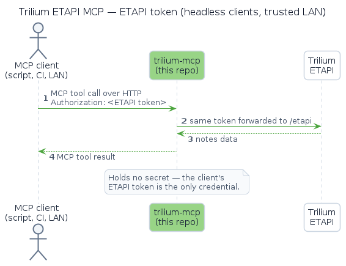
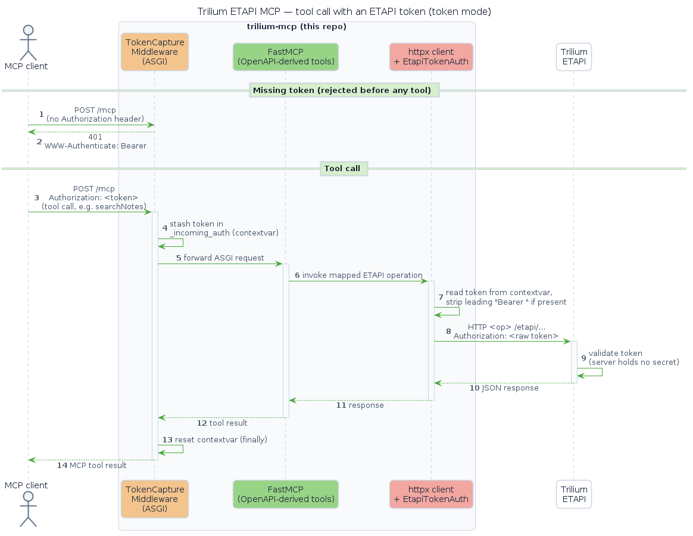
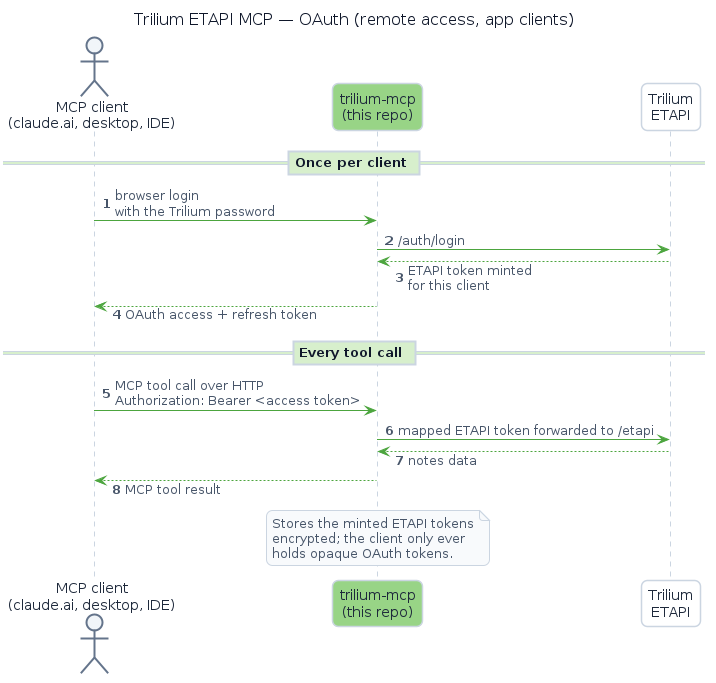
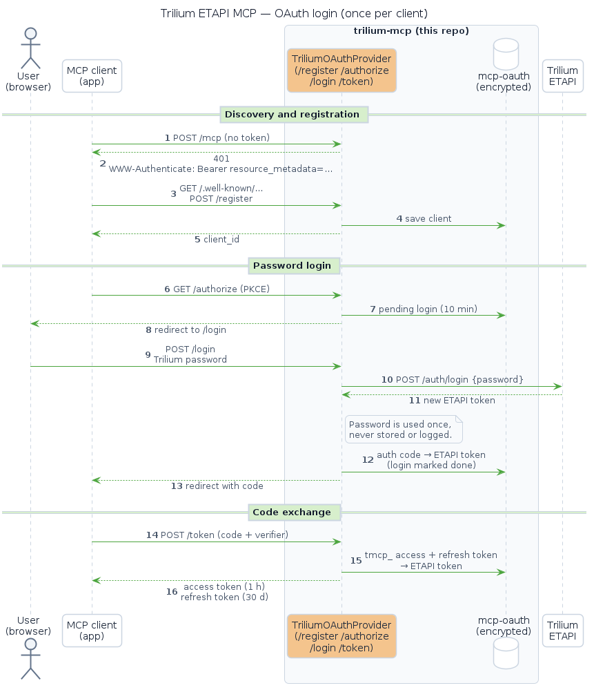
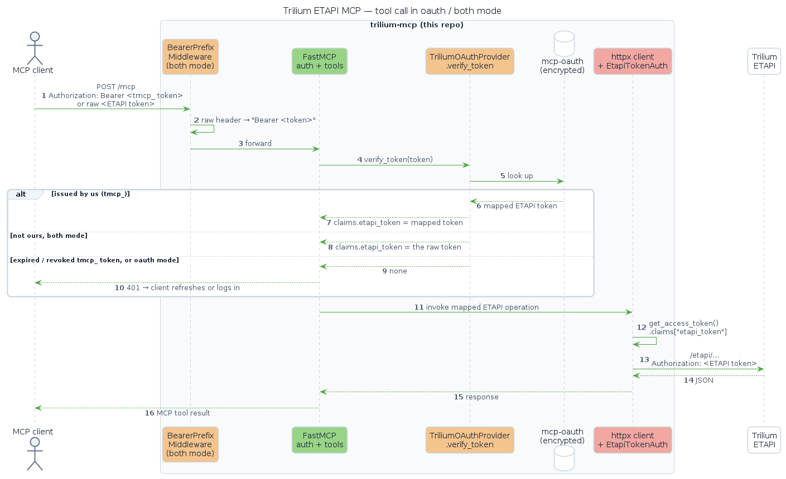
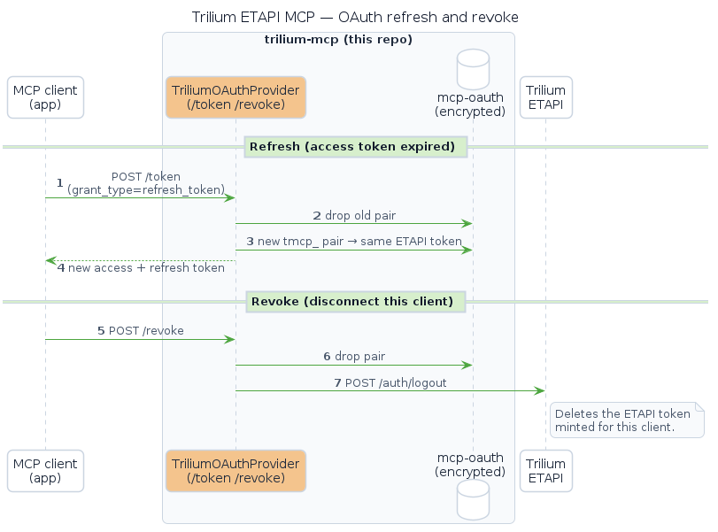
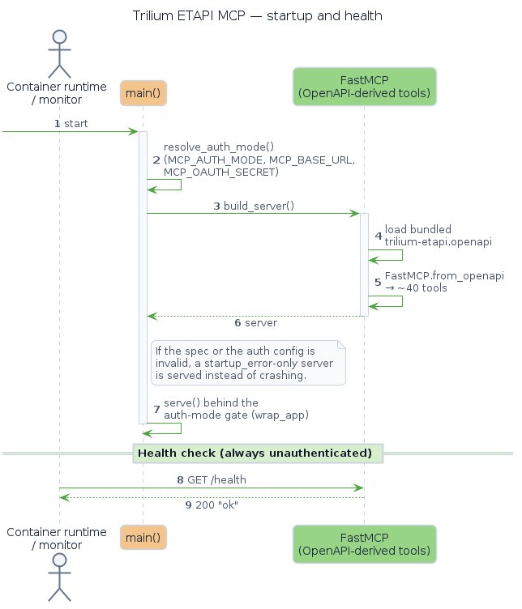

# How it works

trilium-mcp turns every ETAPI endpoint into an MCP tool and forwards each call to Trilium with an ETAPI token: either the one the client sent, or, with OAuth, the one it minted for that client at login.

{ width="720" }

trilium-mcp runs as a container sidecar and talks to Trilium over the internal Docker network, so Trilium's ETAPI is never exposed publicly on its own. Clients reach it through a TLS-terminating reverse proxy or directly over a trusted LAN.

## Tools from the OpenAPI spec

At startup the server reads the bundled ETAPI OpenAPI spec and generates one tool per endpoint with `FastMCP.from_openapi`. A few endpoints don't fit the JSON-in, JSON-out shape and are handled specially:

- **Text and HTML responses** (such as `getNoteContent`) keep the generated tool but drop its output schema.
- **ZIP export** (`exportNoteSubtree`) is replaced by a tool that unpacks the archive and returns readable text.
- **Plain-text uploads** (`putNoteContentById`, `putAttachmentContentById`) are replaced by tools that send the body with an explicit `text/plain` content type.
- **`login` and `logout`** are left out: clients already authenticate through the header, and logout would invalidate their own credential.

## ETAPI token

{ width="560" }

??? note "In detail: tool call in token mode"

    The middleware rejects any request without an `Authorization` header, and the token is carried per request from the middleware to the outgoing ETAPI call:

    { width="720" }

## OAuth

{ width="560" }

??? note "In detail: login (discovery, registration, password, code exchange)"

    The client discovers the OAuth endpoints from the `401`, registers itself, and sends the user to the login page. The Trilium password is exchanged once for a fresh ETAPI token; the client only ever holds opaque `tmcp_` tokens that map to it:

    { width="720" }

??? note "In detail: tool call in oauth or both mode"

    `verify_token` maps a `tmcp_` token to its ETAPI token. In `both` mode any other token is passed through as a raw ETAPI token, and an expired `tmcp_` token gets a `401` so the client refreshes:

    { width="720" }

??? note "In detail: refresh and revoke"

    { width="720" }

## Startup and health

??? note "In detail: startup, startup_error fallback, health check"

    { width="640" }
